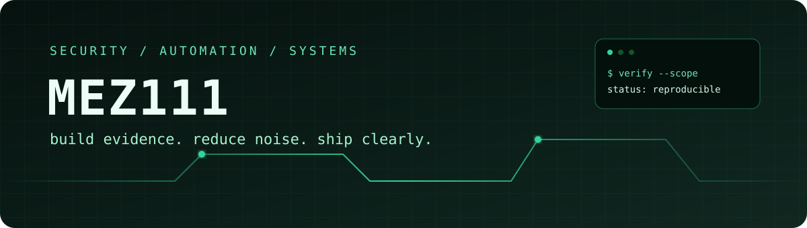

<p align="center">
  
</p>

<p align="center">
  <strong>Security engineering through explainable systems.</strong><br>
  Evidence-gated reasoning · authorization drift · attack paths · static analysis · exposure intelligence
</p>

<p align="center">
  <a href="https://github.com/MEZ111/barq-crs"></a>
  <a href="https://github.com/MEZ111/authz-diff"></a>
  <a href="https://github.com/MEZ111/aegis-graph"></a>
  <a href="https://github.com/MEZ111/pysinktrace"></a>
  <a href="https://github.com/MEZ111/surface-delta"></a>
  <a href="https://github.com/MEZ111/beacon-lens"></a>
</p>

---

## Security systems portfolio

<table>
<tr>
<td colspan="2" valign="top">

### ⚡ [BARQ-CRS](https://github.com/MEZ111/barq-crs)
**Evidence-gated cyber reasoning system**

Analyzes APKs with a dependency-free binary Manifest decoder, derives authorization and state tests from OpenAPI, imports HAR/Burp traffic, and performs scope-gated read-only collection across controlled identities. One campaign correlates mobile attack surface, BOLA/tenant differentials, security drift, patch-seeded AST variants, REST sequences, and state collisions, then emits a report, test plan, SARIF, and hash-chained evidence ledger. Includes 101 deterministic tests and a synthetic ground-truth benchmark.

</td>
</tr>
<tr>
<td width="50%" valign="top">

### [AuthZDiff](https://github.com/MEZ111/authz-diff)
**Semantic API authorization regression analysis**

Resolves effective OpenAPI security and detects authentication removal, weakened OAuth scopes, removed security schemes, and new anonymous sensitive routes. Emits Markdown, JSON, or SARIF and can block a release by severity.

</td>
<td width="50%" valign="top">

### [AegisGraph](https://github.com/MEZ111/aegis-graph)
**Counterfactual attack-path intelligence**

Enumerates bounded routes from entry points to crown jewels, preserves the technique chain, ranks risk, and applies weighted hitting-set analysis to answer: *which security control breaks the most dangerous paths?*

</td>
</tr>
<tr>
<td width="50%" valign="top">

### [PySinkTrace](https://github.com/MEZ111/pysinktrace)
**Interprocedural Python taint tracing**

Uses the Python AST to follow request input through assignments and local wrappers into command execution, SQL, `eval`, and `exec`. Every SARIF finding contains the source, sink, and line path.

</td>
<td width="50%" valign="top">

### [SurfaceDelta](https://github.com/MEZ111/surface-delta)
**Attested attack-surface drift**

Compares service snapshots, detects new exposure and TLS regressions, applies custom risk policy, and attaches SHA-256 provenance so every decision points back to the exact evidence.

</td>
</tr>
<tr>
<td width="50%" valign="top">

### [BeaconLens](https://github.com/MEZ111/beacon-lens)
**Explainable network-behavior triage**

Analyzes Zeek JSON for periodic flows, stable payload patterns, and DNS encoding candidates. Reports interval variation, byte variation, entropy, length, and uniqueness instead of an opaque verdict.

</td>
<td width="50%" valign="top">

### [Recon Evidence](projects/recon-evidence/README.md)
**Reconnaissance evidence normalization**

Normalizes mixed JSONL, removes duplicate observations with stable fingerprints, rejects malformed input, and produces an auditable review queue.

</td>
</tr>
</table>

## One architecture across every tool

```text
evidence acquisition
        ↓
normalization + provenance
        ↓
explainable analysis
        ↓
policy threshold
        ↓
human decision / CI gate
```

No hidden scoring model. No unsupported exploitability claims. Each engine exposes the evidence, assumptions, limits, and deterministic logic behind its output.

<div dir="rtl">

أبني أدوات أمنية تشرح النتيجة ومسارها، من الدليل الخام إلى القرار. كل مشروع قابل للتثبيت والتشغيل والاختبار، وحدوده مكتوبة بوضوح.

</div>

## Coverage

| Security layer | Engine | Output |
| --- | --- | --- |
| Mobile, API, and evidence fusion | BARQ-CRS | APK findings, schema test plans, ranked hypotheses, ledger, SARIF |
| API authorization | AuthZDiff | semantic regressions, SARIF |
| Threat modeling | AegisGraph | ranked paths, control impact, Mermaid |
| Application security | PySinkTrace | interprocedural source-to-sink traces |
| External exposure | SurfaceDelta | attested drift and policy gates |
| Network detection | BeaconLens | statistical behavior signals |
| Recon operations | Recon Evidence | normalized, deduplicated evidence |

## Verification

The six independent repositories contain **122 deterministic tests**. Each repository installs its real CLI and runs verification through GitHub Actions.

```bash
barq mobile application.apk
barq api-plan openapi.json --max-cases 250
barq hunt campaign.json --output barq-output
barq collect policy.json requests.json profiles.json
barq authz observations.jsonl
barq variants security-fix.diff src/
authz-diff base.yaml candidate.yaml --format sarif
aegis-graph model.json --format mermaid
pysinktrace src/ --format sarif
surface-delta before.jsonl after.jsonl --policy policy.json
beacon-lens zeek.jsonl --json
```

---

<p align="center">
  <a href="SECURITY.md">Security policy</a> ·
  <a href="CONTRIBUTING.md">Contribution standards</a> ·
  <a href="https://github.com/MEZ111?tab=repositories">All repositories</a>
</p>
